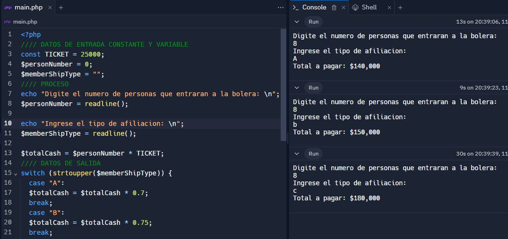

<h1>Taller 10 - Andres Mauricio Gonzalez Acosta</h1>

<h2>Informacion</h2>

Curso: Full stack Básico - Grupo 1

Profesor: Cristian Patiño

<h2>Punto 1: Constantes y Variables</h2>

<h2>Punto 2: Suma de Constantes y Variables</h2>

<h2>Punto 3: Suma de dos numeros indicados por el usuario</h2>

<h2>Punto 4: Datos de usuario en la consola</h2>

<h2>Punto 5: Entrada de bolera usando if / else</h2>

<h2>Punto 6: Deteccion de mayoria de edad</h2>

<h2>Punto 7: Selección de operación aritmética</h2>

<h2>Punto 8: Entrada de bolera usando Switch</h2>

<h2>Punto 9: Tabla de multiplicar usando while</h2>

<h2>Punto 10: Números pares usando while</h2>

<h2>Punto 11: Números impares usando for</h2>

<h2>Punto 12: Tabla de multiplicar usando for</h2>

<h2>Punto 13: Suma de valores de un arreglo usando foreach</h2>

<h2>Punto 14: Revision de contraseña</h2>

<h2>Punto 15: Selección de operación aritmética usando funciones</h2>
